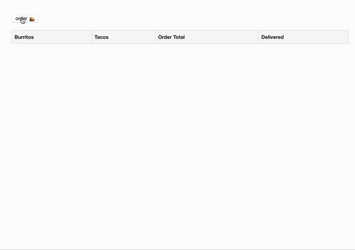

# taqueria

Order tacos 🌮 or burritos 🌯 & send OTLP signals to Dynatrace.

This app is written in Python 🐍.

## Transaction flow

```
┌───────────┐   ┌──────────┐  ┌──────────────┐  
│           │   │          │  │              │   
│           │   │          │  │              │   
│ Frontend  │   │ Checkout │  │   Delivery   │   
│           │   │          │  │              │   
│           │   │          │  │              │   
└───────────┘   └──────────┘  └──────────────┘   
                                                 
 ┌───────────┐                   ┌───────────┐  
 │  /orders  ├────────────────▶  │  /orders  │◀─┐
 └───────────┘                   └───────────┘  │
       ┌────────────────────────────────┐       │
       │  gets JSON of current orders   │       │
       └────────────────────────────────┘       │
                                                │
 ┌───────────┐   ┌──────────┐                   │
 │ /checkout ├───▶    /     │─────────┐         │
 └───────────┘   └──────────┘         │         │
                                      ▼         │
  ┌─────────────────────────┐   ┌──────────┐    │
  │  Add an order to Redis  │   │    /     │──┐ │
  └─────────────────────────┘   └──────────┘  │ │
               │                              │ │
               │          ┌─────────────────┐ │ │
               │          │Mark as delivered│ │ │
               │          │   and expire    │ │ │
               │          └─────────────────┘ │ │
               │                              │ │
               │           ┌───────────────┐  │ │
               └──────────▶│     Redis     │◀─┘ │
                           └───────────────┘    │
                                   ▲            │
                                   │            │
                                   └────────────┘
```

## Run locally or on a VM

There are three microservices, each in their own subdirectory.

- frontend/frontend.py
- checkout/checkout.py
- delivery/delivery.py

### Prerequisites

- python 3.6+
- redis
- a Dynatrace token
    - Data ingest, e.g.: metrics and events (DataImport)
    - Ingest OpenTelemetry traces  (openTelemetryTrace.ingest)

Mac users can run `./install-local.sh` to install redis run pip install for each microservice.

### Environment variables

```
export app=local
export version="1.0.1"
export dt_url='https://(your dynatrace endpoint)/api/v2/otlp/v1/metrics'
export dt_metrics_endpoint="https://(your dyntrace environment)/api/v2/otlp/v1/metrics"
export dt_traces_endpoint= "https://(your dynatrace environemtn)/api/v2/otlp/v1/traces"
export rum_code='<script type="text/javascript" src="copy from Dynatrace RUM injection settings"></script>'
```

### Starting the application

This only works on a mac with Redis installed via Homebrew

```
./start.sh
```

Browse the frontend on `http://127.0.0.1:5001`

### Stopping the application

Also only works on a mac with Redis installed via Homebrew

```
./stop.sh
```

## Running in Kubernetes

### Dynatrace prerequisites

Works as of December 2022. Who knows if they still work today 😥?

- An API access token with these scopes:
    - Access problem event feed, metrics, and topology (DataExport)
    - PaaS integration - Installer download (InstallerDownload)
    - Create ActiveGate tokens (activeGateTokenManagement.create)
    - Read entities (entities.read)
    - Read settings (settings.read)
    - Write settings (settings.write)
- A data ingest token 
    - Data ingest, e.g.: metrics and events (DataImport)
    - Ingest OpenTelemetry traces (openTelemetryTrace.ingest)


#### Install the Dynatrace Operator in Cloud Native mode

```
kubectl create namespace dynatrace
kubectl -n dynatrace create secret generic dynakube --from-literal="apiToken=(your token)" --from-literal="dataIngestToken=(your token)"
kubectl apply -f https://github.com/Dynatrace/dynatrace-operator/releases/download/v0.10.0/kubernetes.yaml
kubectl apply -f https://github.com/Dynatrace/dynatrace-operator/releases/download/v0.10.0/kubernetes-csi.yaml
```

#### Create a Dynakube as follows:

Make sure to edit `apiURL` with your api address.

```
apiVersion: dynatrace.com/v1beta1
kind: DynaKube
metadata:
  name: dynakube
  namespace: dynatrace
  annotations:
    feature.dynatrace.com/automatic-kubernetes-api-monitoring: "true"
spec:
  namespaceSelector:
    matchLabels:
      monitoring: dynatrace
  apiUrl: https://(YOUR API URL)/api
  oneAgent:
    cloudNativeFullStack:
      tolerations:
        - effect: NoSchedule
          key: node-role.kubernetes.io/master
          operator: Exists
        - effect: NoSchedule
          key: node-role.kubernetes.io/control-plane
          operator: Exists
  activeGate:
    capabilities:
      - routing
      - kubernetes-monitoring
      - dynatrace-api
    resources:
      requests:
        cpu: 500m
        memory: 512Mi
      limits:
        cpu: 1000m
        memory: 1.5Gi
```

#### Deploy the Dynakube

```
kubectl apply -f dynakube.yaml
```

### Deploy the Taqueria app

#### Create and label the namespace

```
kubectl create namespace taqueria
kubectl label namespace taqueria monitoring=dynatrace
```

#### Create secrets and configmap

Save this as `taqueria.yaml`

```
apiVersion: v1
kind: ConfigMap
metadata:
  name: taqueria
  namespace: taqueria
data:
  dt_metrics_endpoint: "https://(your dyntrace environment)/api/v2/otlp/v1/metrics"
  dt_traces_endpoint: "https://(your dynatrace environemtn)/api/v2/otlp/v1/traces"
---
apiVersion: v1
kind: Secret
metadata:
  name: taqueria
type: Opaque
stringData:
    dttoken: "your trace / metric ingest token"
```

#### Deploy the secret and configmap


```
kubectl apply -f taqueria.yaml -n taqueria
```

#### Deploy the application (tested on GKE, YMMV on others)

```
./deploy.sh
```

#### Get the load balancer ingress IP address

```
kubectl describe services frontend -n taqueria
```

#### Browse and order some tacos



### Load generation and CPU leaks

The `scheduler` workload generates load by ordering tacos and burritos every 7 seconds. It also creates a CPU leak every hour at :30 past the hour. The leak ends at :34 past the hour. This CPU leak is created by patching the `delivery` workload with environment variable version=1.1.1, which creates a CPU leak. Afterwards, it re-patches the variable back to 1.0.1, which removes the leak. 

## Questions?

File a [Github issue](https://github.com/mreider/taqueria/issues)

Thanks! 👨‍🦲